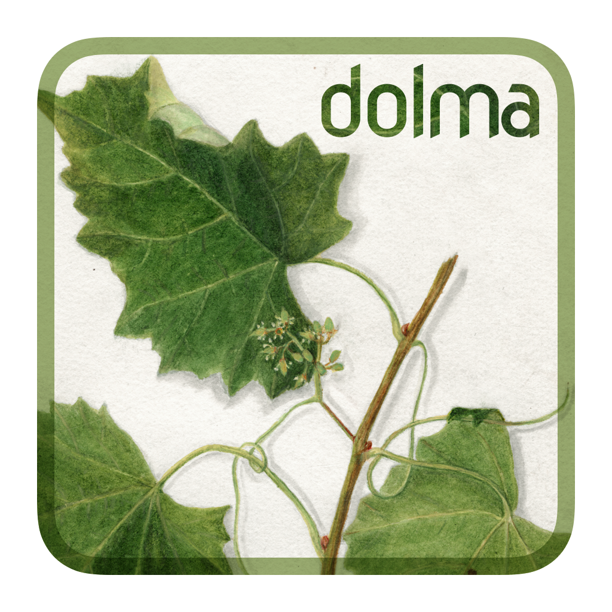

# dolma

*Data to feed OLMo's Appetite*


</img>

Data and tools for generating and inspecting OLMo pre-training data.


## Setup

Install Rust
```
curl https://sh.rustup.rs -sSf | sh
```

Install [CMake](https://cmake.org/install/)

  * On **Mac OSX** with `brew install cmake`
  * On **Linux** with `apt-get install cmake`


Install [OpenSSL](https://www.openssl.org/)

  * On **Mac OSX** with `brew install openssl re2`
  * On **Linux** with `apt-get install openssl`

Install [Protobuf]()

  * On **Mac OSX** with `brew install protobuf`
  * On **Linux** with `apt-get install protobuf-compiler`

Setting up Python
```
conda create -n dolma python=3.10
```


Install [Maturin](https://www.maturin.rs/)

```
pip install maturin
maturin develop
```


Installing this repository
```
cd dolma
pip install -e .
```


## Citation

If you use this repository, please cite it as:

```bibtex
@software{dolma,
    author = {{Soldaini, Luca and Lo, Kyle and Kinney, Rodney and Naik, Aakanksha and Ravichander, Abhilasha and Bhagia, Akshita and Groeneveld, Dirk and Schwenk, Dustin and Magnusson, Ian and Chandu, Khyathi}},
    license = {{Apache-2.0}},
    title = {{DOLMa}},
    url = {https://github.com/allenai/dolma}
}
```
