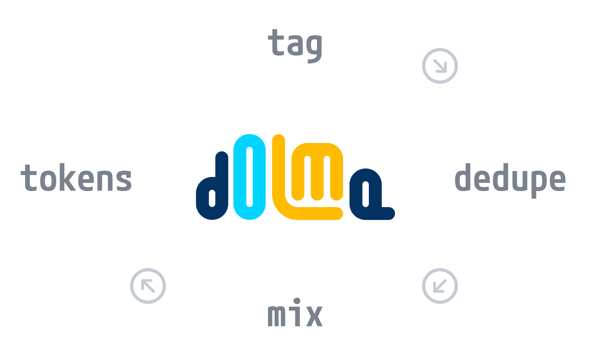

# Dolma Toolkit Documentation


The Dolma toolkit enables dataset curation for pretraining AI models. Reason to use the Dolma toolkit are:

- **High performance** ⚡️ Dolma toolkit is designed to be highly performant, and can be used to process datasets with billions of documents in parallel.
- **Portable** 🧳 Dolma toolkit can be run on a single machine, a cluster, or a cloud computing environment.
- **Built-in taggers** 🏷 Dolma toolkit comes with a number of built-in taggers, including language detection, toxicity detection, perplexity scoring, and common filtering recipes, such as the ones used to create [Gopher](https://arxiv.org/abs/2112.11446) and [C4](https://arxiv.org/abs/1910.10683).
- **Fast deduplication** 🗑 Dolma toolkit can deduplicate documents using rust-based a Bloom filter, which is significantly faster than other methods.
- **Extensible** 🧩 Dolma toolkit is designed to be extensible, and can be extended with custom taggers.
- **Cloud support** ☁️ Dolma toolkit supports reading and write data from local disk, and AWS S3-compatible locations.

Dataset curation with the Dolma toolkit usually happens in four steps:

1. Using **taggers**, spans of documents in a dataset are tagged with properties (e.g. the language their are in, toxicity, etc);
2. Documents are optionally **deduplicated** based on their content or metadata;
3. Using the **mixer**, documents removed or filtered depending on value of attributes;
4. Finally, documents can be **tokenized** using any [HuggingFace-compatible tokenizer](https://huggingface.co/docs/tokenizers/index).



Dolma toolkit can be installed using `pip`:

```shell
pip install dolma
```

Dolma toolkit can be used either as a Python library or as a command line tool. The command line tool can be accessed using the `dolma` command. To see the available commands, use the `--help` flag.

```shell
dolma --help
```

## Index

To read Dolma toolkit's documentation, visit the following pages:

- [Getting Started](getting-started.md)
- [Data Format](data-format.md)
- [Taggers](taggers.md)
- [Deduplication](deduplication.md)
- [Mixer](mixer.md)
- [Tokenization](tokenize.md)
- [Contributing to Dolma Toolkit](develop.md)
